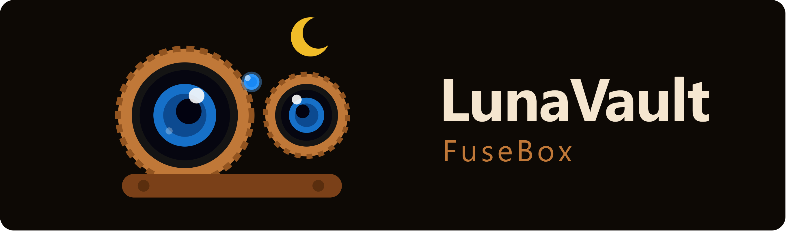

<p align="center">
  
</p>

<p align="center"><em>Preserve every moment. Losslessly.</em></p>

# LunaVault FuseBox

A desktop app for turning a day's worth of camera clips into a single, properly
archived master file — with both microphones kept intact and in sync — plus a
quick tool for trimming and colour-grading clips to share.

Built for anyone who shoots with a wireless mic: your camera records the
Bluetooth mic into the MP4 while a separate WAV preserves the on-board mic.
FuseBox pairs them, aligns them, and merges everything into one lossless `.mov`.

---

## Features

- **Lossless merge** — clips are stream-copied (no re-encode, no quality loss);
  only clips that differ in resolution or frame rate are conformed.
- **Smart two-mic audio** — the Bluetooth mic and the on-board WAV are kept as
  separate tracks, carefully aligned (GCC-PHAT + drift correction), with an
  optional L/R-split or 50/50 combined track.
- **Slow-motion aware** — detects slow-mo clips and time-stretches the WAV
  (pitch-corrected) to match the slowed video.
- **Colour-grade clip export** — trim any moment, apply one of 28 film/cinema
  LUTs, and export a share-ready MP4 (the "WhatsApp clip" tab).
- **Pre-flight** — see exactly what the merge will do (tracks, sizes, time)
  before you commit, with live MB/s + ETA during the render.
- **Review tab** — play back a finished master with frame-step/jog scrubbing, audition
  and mix individual audio tracks, view colour-depth/dynamic-range scopes (histogram
  and RGB waveform), an audio waveform/spectral view per track, and take full-resolution
  snapshots.
- **Light / dark / system theme** and a clean, grouped UI.

## Platforms

| Platform | Status |
|----------|--------|
| Windows | Supported |
| Steam Deck / Linux | Supported (run from source or PyInstaller; Flatpak planned) |
| macOS | Planned |
| Web (in-browser) | Planned (ffmpeg.wasm companion) |

## Run from source

Requires Python 3.10+, plus `ffmpeg`/`ffprobe` binaries in `bin/` (not bundled
in the repo — see below).

```bash
pip install -r requirements.txt
python src/main.py
```

On Linux / Steam Deck the helper script sets up a virtual environment for you:

```bash
./run_linux.sh
```

### ffmpeg binaries

Place a static `ffmpeg` + `ffprobe` (GPL build, with libx264/libx265) in `bin/`:

- Windows: from https://www.gyan.dev/ffmpeg/builds/ → `bin/ffmpeg.exe`, `bin/ffprobe.exe`
- Linux: from https://johnvansickle.com/ffmpeg/ → `bin/ffmpeg`, `bin/ffprobe`

## Build a standalone app

- Windows: `build.bat` → `dist/LunaVaultFuseBox/`
- Linux / Steam Deck: `./build_linux.sh` → `dist/LunaVaultFuseBox/`

## Tests

```bash
python tests/test_ffmpeg_cmd.py
python tests/test_sync_advanced.py
# ...etc — each test file runs standalone, or use pytest
```

## Licensing

The application code is **MIT** (see [LICENSE](LICENSE)). It bundles third-party
components under their own licenses — notably **FFmpeg (GPL)** — see
[licenses/THIRD-PARTY-LICENSES.md](licenses/THIRD-PARTY-LICENSES.md).

## Credits

Built with the help of Claude (Anthropic). Powered by FFmpeg, PySide6/Qt, and NumPy.
